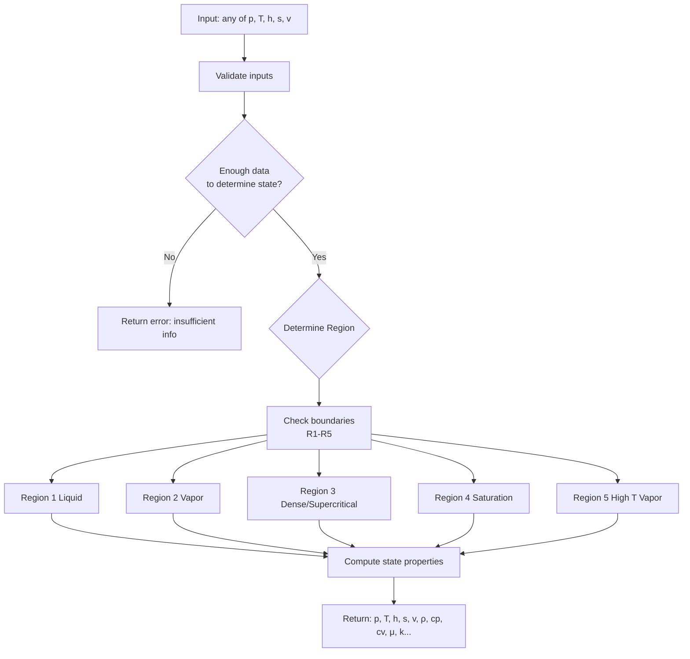

# Steam Calculation Library

A work-in-progress Rust library for steam property calculations.

Following the **The International Association for the Properties of Water and Steam (IAPWS)** publication with reference **[IAPWS R7-97(2012)](https://iapws.org/public/documents/UWTF-/IF97-Rev.pdf)**

⚠️ **Work in Progress** - This library is currently under active development.

## Flowchart


## Description

This library provides thermodynamic property calculations for steam and water, useful for engineering applications involving steam systems.

## Features

- [ ] Region 1 — Compressed (subcooled) liquid
- [ ] Region 2 — Superheated steam
- [ ] Region 3 — Dense / critical region
- [X] Region 4 — Saturation line
- [ ] Region 5 — High-temperature steam

## Installation

```toml
[dependencies]
steam = "0.1.0"
```

## Usage

Get the pressure from temperature or reversed for saturated line. (Region 4):

```rust
use steam::{
    Pressure,
    Temperature,
    saturation::{ts, ps},
};

fn main() -> Result<(), steam::SteamError> {
    // --- Example 1: Tsat from pressure ---

    let p = Pressure::from_bar(10.0); // 10 bar(a)
    let t_sat = ts(p)?;               // Tsat at 10 bar

    println!("Tsat at 10 bar = {:.3} °C", t_sat.as_celsius());
    println!("Tsat at 10 bar = {:.3} K",  t_sat.as_kelvin());


    // --- Example 2: Psat from temperature ---

    let t = Temperature::from_celsius(150.0); // 150°C
    let p_sat = ps(t)?;                       // Psat at 150°C

    println!("Psat at 150 °C = {:.3} bar", p_sat.as_bar());
    println!("Psat at 150 °C = {:.3} MPa", p_sat.as_mpa());

    
    // --- Example 3: Round-trip check ---

    let p_test = Pressure::from_bar(5.0);
    let t_test = ts(p_test)?;
    let p_back = ps(t_test)?;

    println!(
        "Round-trip: 5 bar → {:.3} °C → {:.3} bar",
        t_test.as_celsius(),
        p_back.as_bar()
    );

    Ok(())
}

```

## License
This library is licensed under the Apache License, Version 2.0.
Commercial and open-source use is permitted. See LICENSE for details.

## Contributing

Contributions are welcome.
