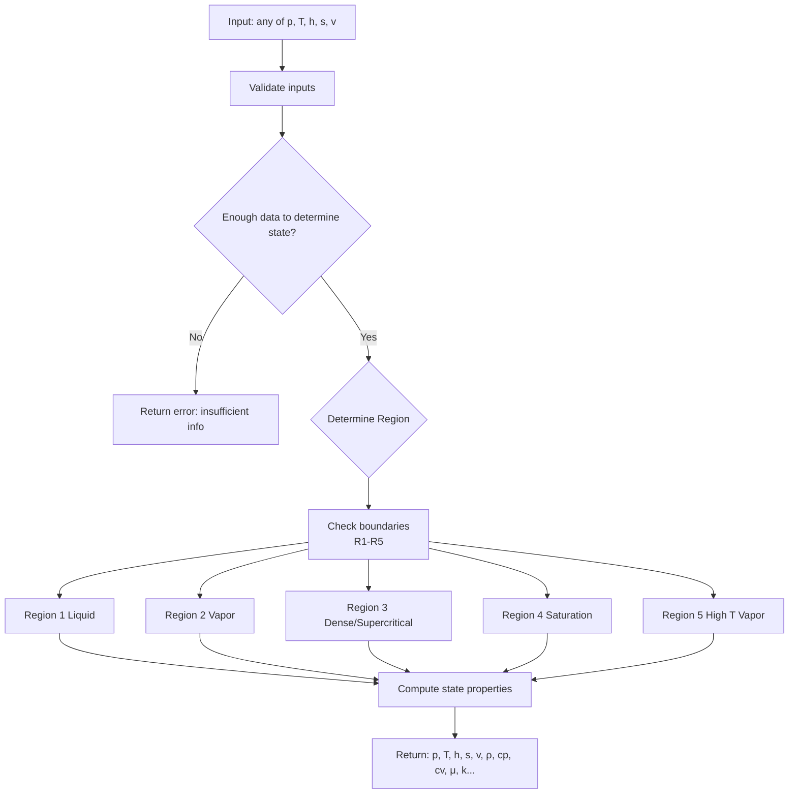

# Steam Calculation Library

A work-in-progress Rust library for steam property calculations.

Following the **The International Association for the Properties of Water and Steam (IAPWS)** publication with reference **[IAPWS R7-97(2012)](https://iapws.org/public/documents/UWTF-/IF97-Rev.pdf)**

⚠️ **Work in Progress** - This library is currently under active development.

## Flowchart

## Description

This library provides thermodynamic property calculations for steam and water, useful for engineering applications involving steam systems.

## License
This library is licensed under the Apache License, Version 2.0.
Commercial and open-source use is permitted. See LICENSE for details.

## Contributing

Contributions are welcome.
